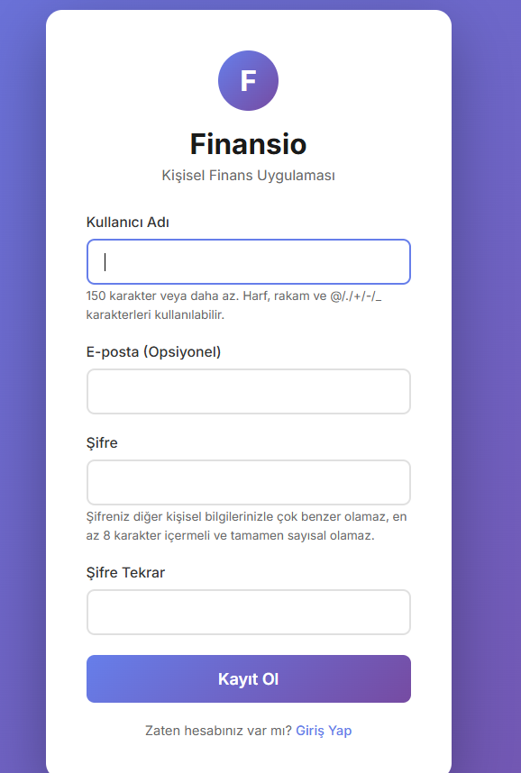
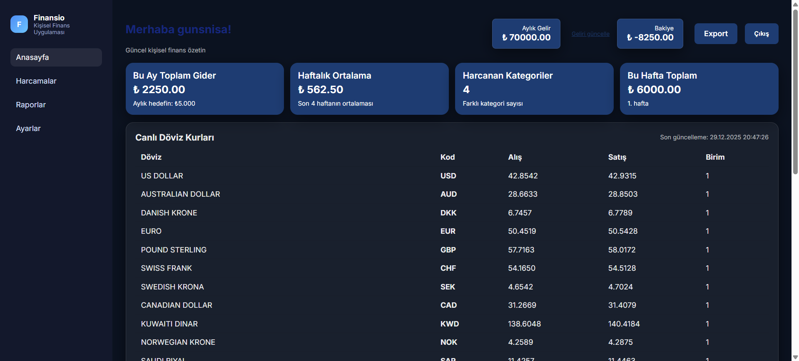
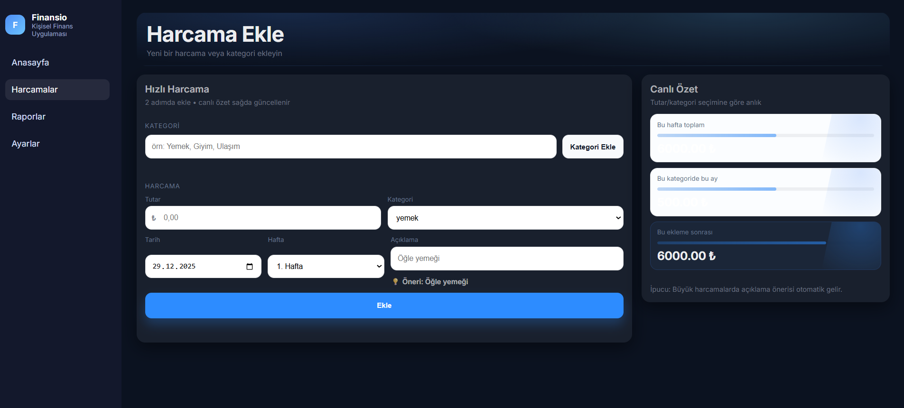
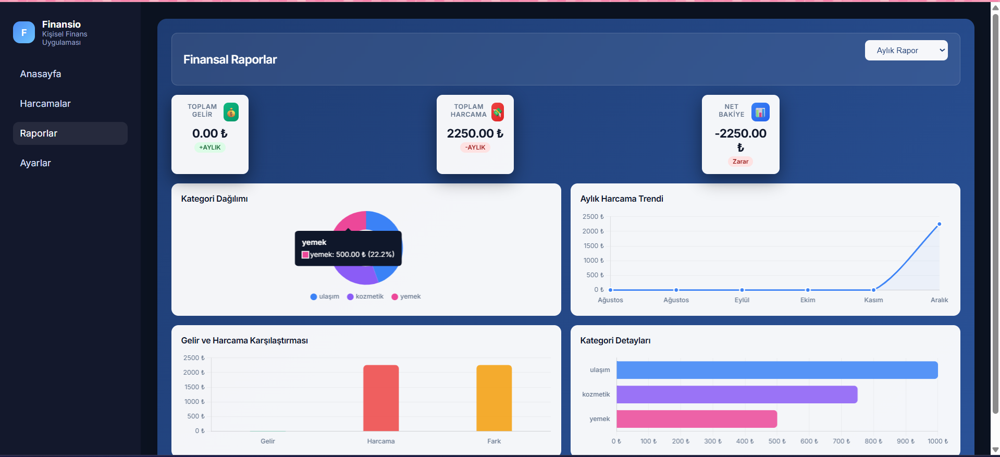
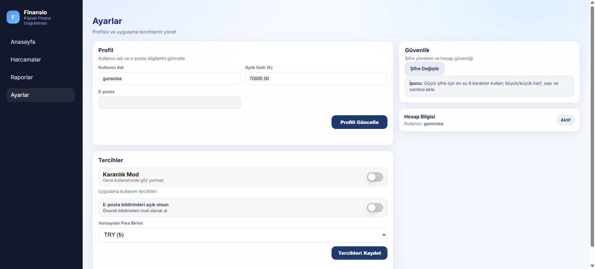

# Finansio 💰

**Finansio**, kullanıcıların gelir ve giderlerini takip edebileceği, raporlar oluşturabileceği ve kişisel finans durumunu analiz edebileceği bir **Django tabanlı kişisel finans yönetim uygulamasıdır**.

Modern bir arayüz, karanlık mod desteği ve detaylı raporlama özellikleriyle kullanıcıya net bir finansal görünüm sunar.

---

## 🚀 Özellikler

- 🔐 Kullanıcı kayıt & giriş sistemi
- 📊 Dashboard ile anlık finans özeti
- 💸 Gelir / gider ekleme ve silme
- 🗂️ Kategori bazlı harcama takibi
- 📈 Haftalık & aylık finansal raporlar
- 🌙 Karanlık / aydınlık mod desteği
- ⚙️ Profil ve uygulama ayarları
- 🛡️ Django Admin paneli

---

## 🖼️ Uygulama Görselleri

### Giriş & Kayıt
<p align="center">
  
  
</p>

---

### Dashboard (Finans Özeti & Canlı Döviz Kurları)
<p align="center">
  
</p>

---

### Harcama Ekleme
<p align="center">
  
</p>

---

### Finansal Raporlar
<p align="center">
  
</p>

---

### Ayarlar
<p align="center">
  
</p>

---

## 🛠️ Kullanılan Teknolojiler

- **Backend:** Python, Django
- **Frontend:** HTML, CSS, JavaScript (Django Templates)
- **Veritabanı:** SQLite (geliştirme ortamı)
- **Grafikler:** Chart.js
- **Kimlik Doğrulama:** Django Auth System

---

## ⚙️ Kurulum

```bash
git clone https://github.com/guneshayrunisa/finansio.git
cd finansio
python -m venv venv
venv\Scripts\activate
pip install -r requirements.txt
python manage.py migrate
python manage.py runserver
